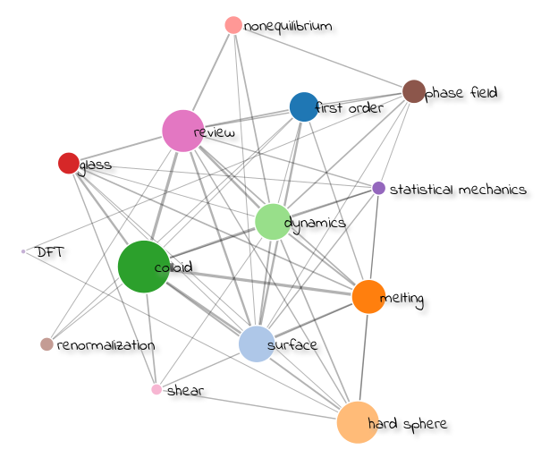

# d3-keywords-network

d3-keywords-network uses `d3.js` (v4) to visualize the reference keywords network.

A visualization of my `zotero` database (~200 papers)


Based on this network, one can conclude that
  1. Most papers I read are associated to `colloid`, `hard sphere`, `melting`, `review` (due to that I wrote a review paper on [`colloidal crystal melting`]("http://onlinelibrary.wiley.com/doi/10.1002/adfm.201603077/full") recently).
  2. For `colloid` papers, most are `melting` papers.
  3. I don't have read many on `nonequilibrium` in `colloid`, which is a pretty important field I should pay more attention.
  4. There is only one review paper on `nonequilibrium` phenomena on `surface`, and I may read more.

## What is reference keywords network?
Given a list of references (e.g. `zotero` research papers), and a list of keywords, then we might want to ask,
  * how many references are there for each keywords?
  * how keywords are related to each other?

Those questions are easy to answer, and a simple search of the database will be enough to do the job.

However, we might further ask
  * **what is there in our database?**
  * **how does it look as a whole?**

This requires us to visualize the database keywords relationship through a network, and this is the **reference keywords network**.
  * **node**: keyword
    - size = number of references associated to the keyword
  * **links**: keyword1 + keyword2
    - weight = number of references associated to two keywords

The association here can be defined in whatever way, e.g. co-occurence of both keywords in `title`, `abstract`, `keywords`, `tag`, `collection`.

Here `getNetwork.py` implements the association as the occurrence in either `title` or `abstract`. Fuzzy search, tags, can be implemented based on it in future.

# Features
* node size (circle area) is proportional to number of references associated to it.
* link width is proportional to the squareroot of the number of references associated to it.
* nodes are draggable.
* Both **node** and **link** are hoverable.
  - hover on **node** will highlight the node itself and those linked to it. Besides that, a list of references associated to the node is shown at the bottom of the page. The list also gives the URL for you to read further.
  - hover on **link** will highlight the link itself, and the two nodes connected by it. Besides that, a list of references associated to the link is shown at the bottom of the page.

# How to use?
For `zotero` users, please see `getNetwork.py` for generating a network `json` file. The keyword list can be customized by oneself.

For other database users, one can use one's favorite method to generate the association network and save as json file. The json file structure looks like this:
```
{
  "nodes": [{"name": "melting",
             "r": 2, "infolist": [1,2]}],
  "links": [{"name": "melting + DFT"},
             "source": 1,
             "target": 2,
             "weight": 1,
             "infolist": [2]],
  "items": {"1": {"title": "abc",
                  "url": "abc"},
            "2": {"title": "def",
                  "url": "def"}}
}
```
